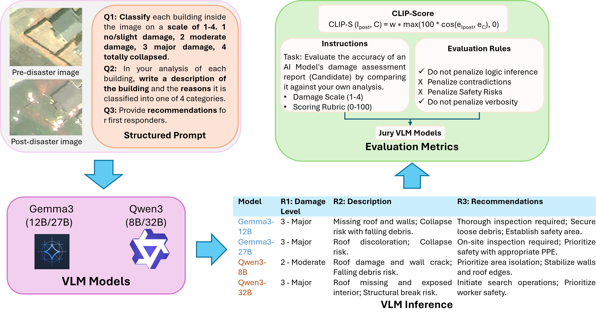

# From-Pixels-to-Semantic
From Pixels to Semantics: A Multi-Stage AI Framework for Structural Damage Detection in Satellite Imagery

## Multi-VLM Framework for Disaster Damage Assessment
<p align="center">
  
</p>

**Figure:** Overview of the Multi-VLM framework for disaster damage assessment. The framework takes pre- and post-disaster images along with a structured prompt as input to multiple Vision-Language Models (VLMs), including **Gemma3** and **Qwen3**. The generated responses are evaluated using **CLIPScore** and **VLM-as-a-Jury** metrics to assess reasoning quality.

### YOLO Model Inference Pipeline

### Install or upgrade the ultralytics package
`pip install -U ultralytics`

### Training
```
from ultralytics import YOLO

#Load a model
model = YOLO('yolov11{n/s/m/l/x}.pt')  # load a pretrained model

#Train the model
results = model.train(data='xView-buildings.yaml', epochs=50, imgsz=640, save=True)
```

### Prediction
```
from ultralytics import YOLO

model = YOLO('yolov11{n/s/m/l/x}.pt')
model.predict('path/to/images', imgz=640, save=True)
```


### CLIPScore Comparison on xBD Disaster Subset (Full Images)

| Disaster Type         | VLM Model                  | Avg. CLIPScore (%) | Max. CLIPScore | Min. CLIPScore |
| --------------------- | -------------------------- | ------------------ | -------------- | -------------- |
| **xBD**               | VLCE (LLaVA-baseline) [1]  | 55.34              | -              | -              |
|                       | VLCE (QwenVL-baseline) [1] | 60.60              | -              | -              |
| **Moore Tornado**     | Qwen3-vl:32b               | **63.34**          | **72.60**      | **54.83**      |
|                       | Qwen3-vl:8b                | 62.87              | 70.42          | 51.40          |
|                       | Gemma3:27b                 | 60.02              | 70.69          | 50.23          |
|                       | Gemma3:12b                 | 60.02              | 68.55          | 51.80          |
| **Matthew Hurricane** | Qwen3-vl:32b               | **62.42**          | **81.04**      | 50.18          |
|                       | Qwen3-vl:8b                | 62.17              | 77.56          | **51.60**      |
|                       | Gemma3:27b                 | 58.18              | 67.72          | 47.19          |
|                       | Gemma3:12b                 | 57.06              | 67.96          | 44.82          |

---


## Citation

If you use this work, please cite:

```bibtex
@article{shakya2026pixels,
  title={From Pixels to Semantics: A Multi-Stage AI Framework for Structural Damage Detection in Satellite Imagery},
  author={Shakya, Bijay and Hoier, Catherine and Ahmed, Khandaker Mamun},
  journal={arXiv preprint arXiv:2603.22768},
  year={2026}
}
