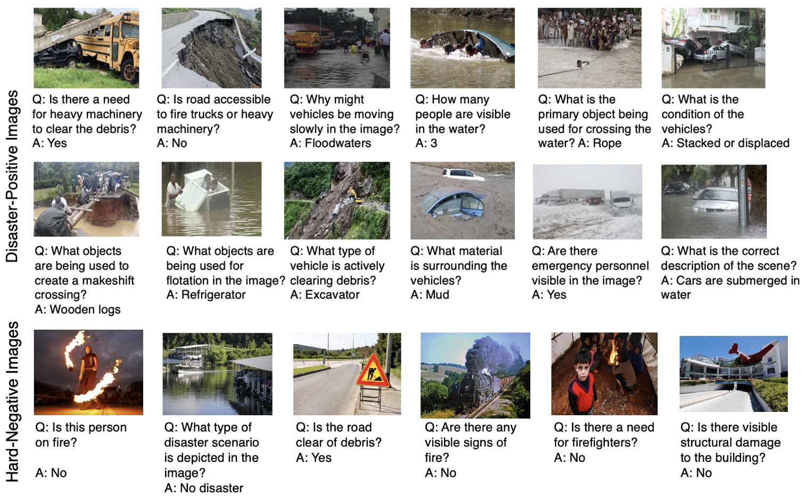
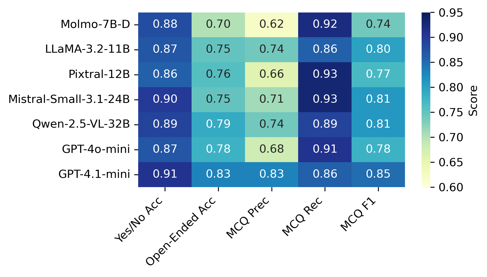
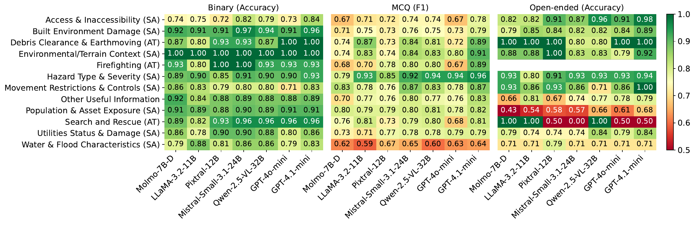
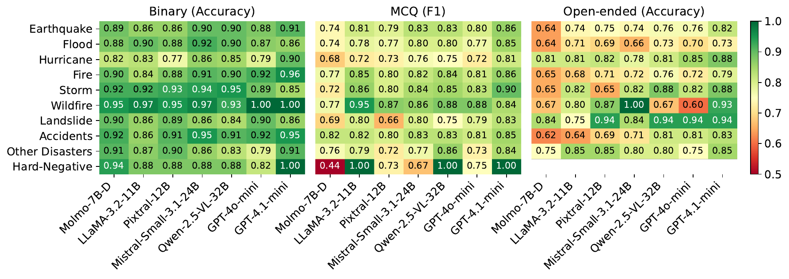
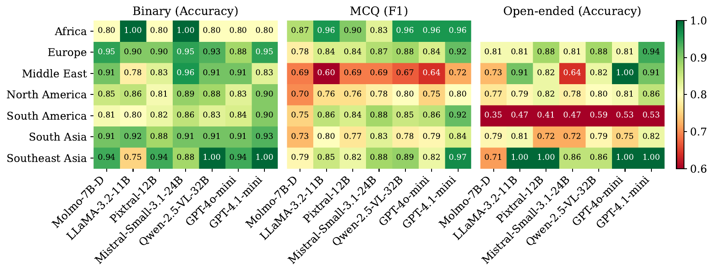
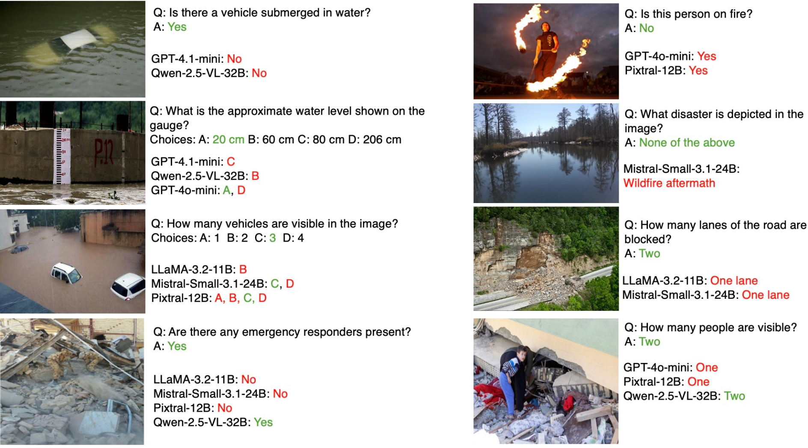

<div align="center">

# DisasterVQA 🌍

### A Visual Question Answering Benchmark Dataset for Disaster Scenes

*Introduced at ICWSM 2026 &nbsp;·&nbsp; 4,405 QA pairs &nbsp;·&nbsp; 1,395 images &nbsp;·&nbsp; 7 models evaluated*

[](https://arxiv.org/abs/2601.13839)
[](https://huggingface.co/datasets/QCRI/DisasterVQA)
[](https://zenodo.org/records/18365212)
[](https://creativecommons.org/licenses/by-sa/4.0/)
[](https://www.icwsm.org/2026/)

<br>



</div>

---

## Dataset Overview

| Property | Value |
|---|---|
| Total QA pairs | 4,405 |
| Unique images | 1,395 |
| Question types | Yes/No (48.9%), Multiple-Choice (38.4%), Open-Ended (12.7%) |
| Disaster categories | earthquake, flood, hurricane, fire, accident, storm, wildfire, landslide, other |
| Image sources | MEDIC, CrisisMMD, Incidents1M |
| Evaluated models (7) | GPT-4o-mini, GPT-4.1-mini, Llama 3.2, Mistral Small, Molmo-7B-D, Pixtral, Qwen2.5-VL |

---

## Quick Links

| Resource | Link |
|----------|------|
| 📄 Paper | [arXiv:2601.13839](https://arxiv.org/abs/2601.13839) |
| 📦 Zenodo | [10.5281/zenodo.18365212](https://zenodo.org/records/18365212) |
| 🤗 Dataset | [HuggingFace](https://huggingface.co/datasets/QCRI/DisasterVQA) |
| 🏛️ Conference | [ICWSM 2026](https://www.icwsm.org/2026/) |

---

## Repository Structure

```
DisasterVQA/
├── dataset/                    # Benchmark dataset
│   ├── disasterVQA_dataset.json
│   ├── disasterVQA_allmodel_judge_outputs.json
│   └── README.md
├── prompts/                    # LLM prompts for question generation and judging
│   ├── question_generation.txt
│   ├── judge_binary.txt
│   ├── judge_mcq.txt
│   └── judge_open_ended.txt
├── inference/                  # Model inference scripts (7 models)
│   ├── gpt4o_mini.py
│   ├── gpt41_mini.py
│   ├── llama32.py
│   ├── mistral_small.py
│   ├── molmo.py
│   ├── pixtral.py
│   ├── qwen25_vl.py
│   └── README.md
├── judge/                      # LLM-as-judge post-processing
│   ├── judge_postprocess.py
│   └── README.md
├── classification/             # Humanitarian category classification
│   ├── classify_humanitarian.py
│   ├── taxonomy.json
│   └── README.md
└── evaluation/                 # Evaluation scripts
    ├── evaluate_by_question_type.py
    ├── evaluate_by_region.py
    ├── evaluate_by_humanitarian_category.py
    └── README.md
```

> **Note:** Images are **not included** in this repository. The full dataset including images is available on [Zenodo](https://zenodo.org/records/18365212) and [HuggingFace](https://huggingface.co/datasets/QCRI/DisasterVQA).

---

## Quick Start

> **Skip to step 4** if you want to use the pre-computed outputs already in `dataset/disasterVQA_allmodel_judge_outputs.json`.
>
> **Pipeline:** `inference/` → `judge/` → `classification/` → `evaluation/`

### 1. Install dependencies

```bash
pip install -r requirements.txt
```

### 2. Run inference

Each script in `inference/` produces a raw output JSON in the same format. Example using GPT-4o-mini:

```bash
python inference/gpt4o_mini.py \
    --input_json  dataset/disasterVQA_dataset.json \
    --output_json outputs/gpt4o_mini_raw.json \
    --deployment  <your-deployment-name> \
    --endpoint    <your-azure-endpoint> \
    --api_key     <your-api-key>
```

See [inference/README.md](inference/README.md) for instructions for every model.

### 3. Judge raw outputs

Combine raw outputs from all models into a single JSON (one entry per question, one key per model), then run the judge:

```bash
python judge/judge_postprocess.py \
    --input           outputs/all_models_raw.json \
    --output          outputs/all_models_judged.json \
    --prompt-yesno    prompts/judge_binary.txt \
    --prompt-mcq      prompts/judge_mcq.txt \
    --prompt-open     prompts/judge_open_ended.txt \
    --endpoint        <your-azure-endpoint> \
    --api-key         <your-api-key> \
    --deployment-name <your-deployment-name>
```

See [judge/README.md](judge/README.md) for details on the expected input format.

### 4. Classify humanitarian categories

Assign each QA entry a humanitarian response category using the taxonomy in `classification/taxonomy.json`:

```bash
python classification/classify_humanitarian.py \
    --input      outputs/all_models_judged.json \
    --output     dataset/disasterVQA_allmodel_judge_outputs.json \
    --deployment <your-deployment-name> \
    --endpoint   <your-azure-endpoint> \
    --api-key    <your-api-key>
```

See [classification/README.md](classification/README.md) for the full taxonomy and optional flags.

### 5. Evaluate

```bash
# Per-model metrics by question type (accuracy, precision, recall, F1)
python evaluation/evaluate_by_question_type.py \
    --input  dataset/disasterVQA_allmodel_judge_outputs.json \
    --output results/metrics_by_question_type.xlsx

# Per-model metrics by geographic region
python evaluation/evaluate_by_region.py \
    --input  dataset/disasterVQA_allmodel_judge_outputs.json \
    --output results/metrics_by_region.xlsx

# Per-model metrics by humanitarian category
python evaluation/evaluate_by_humanitarian_category.py \
    --input  dataset/disasterVQA_allmodel_judge_outputs.json \
    --excel  results/metrics_by_humanitarian_category.xlsx \
    --csv    results/metrics_by_humanitarian_category.csv
```

---

## Results

Overall per-model performance across all question types.

<div align="center">

</div>

**By humanitarian category**

<div align="center">

</div>

**By disaster type**

<div align="center">

</div>

**By geographic region**

<div align="center">

</div>

**Error analysis**

<div align="center">

</div>

To reproduce these results, see the scripts in [`evaluation/`](evaluation/).

---

## License

The benchmark is released under the **Creative Commons Attribution Share Alike 4.0 International (CC BY-SA 4.0)** license. The underlying images belong to their respective source datasets (MEDIC, CrisisMMD, Incidents1M) — please refer to the original dataset licenses for usage terms.

---

## Citation

If you use this dataset in a publication, please also cite the ICWSM 2026 paper:

```bibtex
@inproceedings{disastervqa_icwsm2026,
  author    = {Al-Mohannadi, Aisha and Firoz, Ayisha and Yang, Yin and Imran, Muhammad and Ofli, Ferda},
  title     = {DisasterVQA: A Visual Question Answering Benchmark Dataset for Disaster Scenes},
  booktitle = {Proceedings of the International AAAI Conference on Web and Social Media (ICWSM)},
  year      = {2026},
  address   = {Los Angeles, California, USA},
  url       = {https://arxiv.org/abs/2601.13839}
}
```

---

## Contact

For questions or issues, please open a [GitHub Issue](https://github.com/qcri/DisasterVQA/issues) or contact the authors via the paper.
